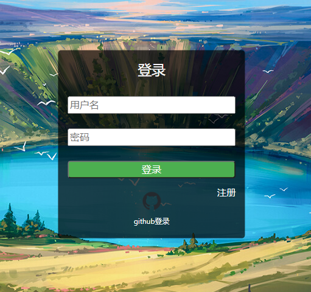

### Python课设

基于Python3.8，使用Django + Django-channels + Redis + Jquery + Canvas开发的 一款H5联机小游戏，愿称其为球球大作战（球球大逃杀），hhh

- 接入Github一键登录，免除注册账号的烦恼（你可能需要自己改一下密钥？）
- 有匹配机制，按隐藏分匹配，优先匹配隐藏分相近的玩家
- 试试对战，目前一局只有3名玩家，方便调试 ~~
- 有单机模式，单机模式有难度区分，机器人也是很猛的噢 ~~
- 角色有3个技能，操作类似LOL，游戏机制模仿吃鸡

运行 script/compress_game_js.sh 

运行 uwsgi --ini scripts/uwsgi.ini 

运行 daphne -b 0.0.0.0 -p 5015 acapp.asgi:application

运行 match_system/match/server.py

最好用nginx代理一下，推荐使用python虚拟环境，如果跑不起来有些配置需要在settings.py里改

